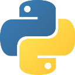

# Diego López Esteban

**Electronic and Automation Engineer**

PCB Design · Embedded Systems · ML · IoT · Python for Engineering · Robotics

## Featured projects

**[TheBUG02](https://github.com/Diegolox/TheBUG02)**
 '- ESP32-based robotic control PCB.

**[TheBUG01](https://github.com/Diegolox/TheBUG01)**
 '- Custom PCB robotic platform.

**[SIGUEPOP](https://github.com/Diegolox/SIGUEPOP)**
 '- Python GUI for ESP32 robot calibration.

## Languages and tools

 
 

## Contact

[Portfolio](https://diegolox.github.io/) · [GitHub](https://github.com/Diegolox) · [LinkedIn](https://www.linkedin.com/in/diego-l%C3%B3pez-esteban-902370383/) · [Email](mailto:diegolop.work@gmail.com)
