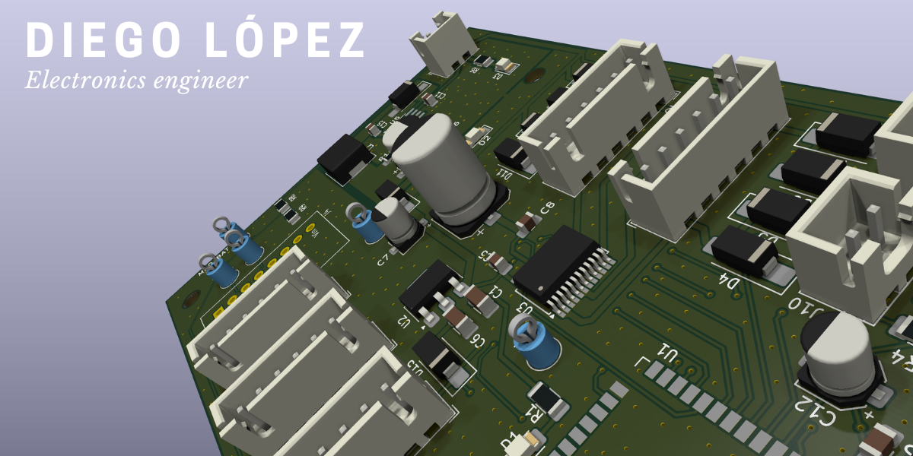
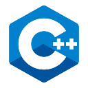

> Learning by building: PCBs, embedded systems, robotics, IoT and ML

## Featured projects

**[TheBUG01](https://github.com/Diegolox/TheBUG01)**
 : Custom PCB robotic platform.

**[TheBUG02](https://github.com/Diegolox/TheBUG02)**
 : An evolution from TheBUG01.

**[SIGUEPOP](https://github.com/Diegolox/SIGUEPOP)**
 : Python GUI for line follower robot calibration.

## Languages and tools

 
 
 

## Contact

[Portfolio](https://diegolox.github.io/) · [GitHub](https://github.com/Diegolox) · [LinkedIn](https://www.linkedin.com/in/diego-l%C3%B3pez-esteban-902370383/) · [Email](mailto:diegolop.work@gmail.com)
