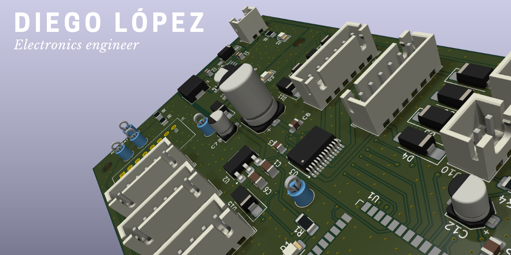
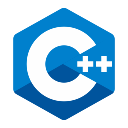
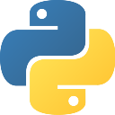

> Learning by building: PCBs, embedded systems, robotics, IoT and ML

## Featured projects

I'm Diego López Esteban, and this is a small selection of projects where I combine hardware design, embedded systems, robotics and engineering software.

| Area     | Project                                                  | Description                                     |
| -------- | -------------------------------------------------------- | ----------------------------------------------- |
| Hardware | **[TheBUG01](https://github.com/Diegolox/TheBUG01)**     | Custom PCB robotic platform.                    |
| Hardware | **[TheBUG02](https://github.com/Diegolox/TheBUG02)**     | An evolution from TheBUG01.                     |
| Software | **[SIGUEPOP](https://github.com/Diegolox/SIGUEPOP)**     | Python GUI for line follower robot calibration. |
| Software | **[SUMO JRG26](https://github.com/Diegolox/SUMO_JRG26)** | A sumo algorithm for robot combat.              |
| Software | **[FOLLOW_THE_CATAPUM](https://github.com/Diegolox/FOLLOW-THE-CATAPUM)** | Telemetry software for ALUnizar rocketry team.|

[View all projects here →](https://github.com/Diegolox?tab=repositories)

## Languages and tools

 

## Repository lists

<strong>Hardware projects</strong>

 

| Project                                              | Description                  |
| ---------------------------------------------------- | ---------------------------- |
| **[TheBUG01](https://github.com/Diegolox/TheBUG01)** | Custom PCB robotic platform. |
| **[TheBUG02](https://github.com/Diegolox/TheBUG02)** | An evolution from TheBUG01.  |
| **[A SIMPLE BUCK](https://github.com/Diegolox/A-SIMPLE-BUCK)** | Just a buck.  |

<strong>Software projects</strong>

 

| Project                                                  | Description                                     |
| -------------------------------------------------------- | ----------------------------------------------- |
| **[SIGUEPOP](https://github.com/Diegolox/SIGUEPOP)**     | Python GUI for line follower robot calibration. |
| **[SUMO JRG26](https://github.com/Diegolox/SUMO_JRG26)** | A sumo algorithm for robot combat.              |
| **[FOLLOW THE CATAPUM](https://github.com/Diegolox/FOLLOW-THE-CATAPUM)** | A Telemetry software for monitoring model rocket.|

## [TEMPORAL] Laboratorio de comunicaciones IoT
| Práctica                                                 |
| -------------------------------------------------------- |
| **[P1_ARD_NANO](https://github.com/Diegolox/P1_ARD_NANO_33_BLE)**     | 
| **[P2_RTOS](https://github.com/Diegolox/P2_FIRMWARE_BASADO_EN_RTOS)** | 
| **[P2_WIFI](https://github.com/Diegolox/P3_COMUNICACIONES_WIFI_y_stack_IP_ESP32/tree/main)** | 

## Contact

[Portfolio](https://diegolox.github.io/) · [GitHub](https://github.com/Diegolox) · [LinkedIn](https://www.linkedin.com/in/diego-l%C3%B3pez-esteban-902370383/) · [Email](mailto:diegolop.work@gmail.com)
